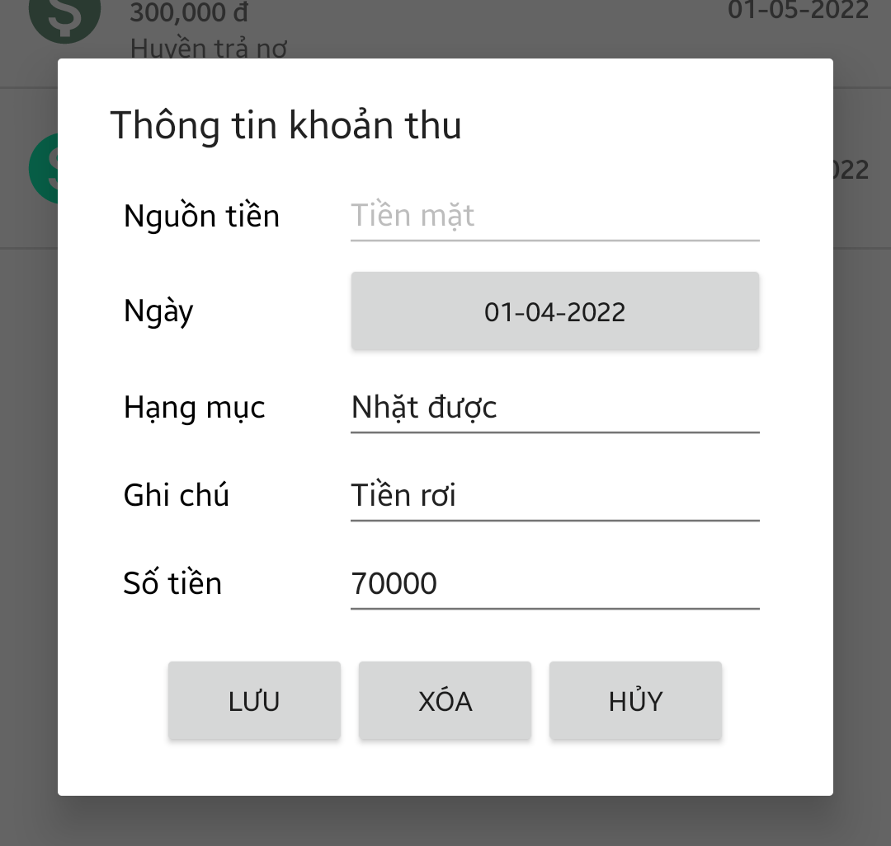
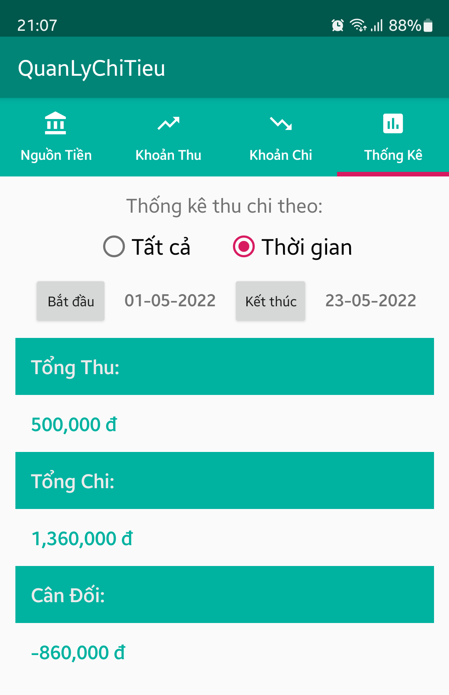

# QuanLyChiTieu

Ứng dụng quản lý chi tiêu trên Android

**Danh sách nguồn tiền**: Xem và quản lý những nguồn tiền (tài khoản, tiền mặt...)

**Khoản thu**: Xem và quản lý thu nhập đầu vào

**Khoản chi**: Xem và quản lý chi tiêu đầu ra

**Xem thống kê**: xem được thống kê tài chính của mình trong khoảng thời gian hoặc tất cả
